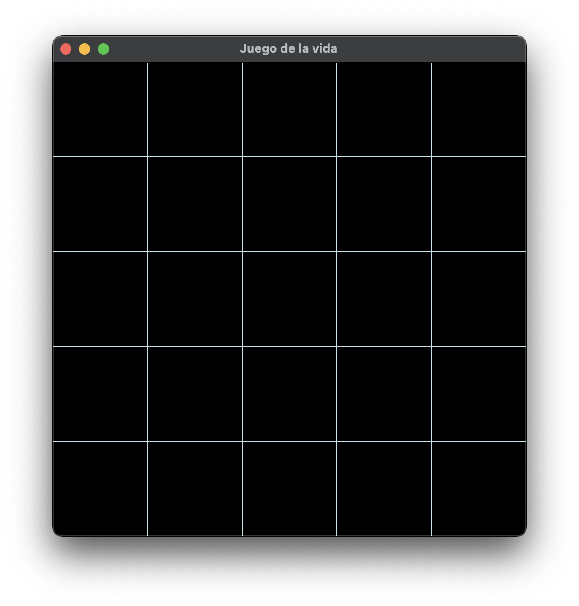
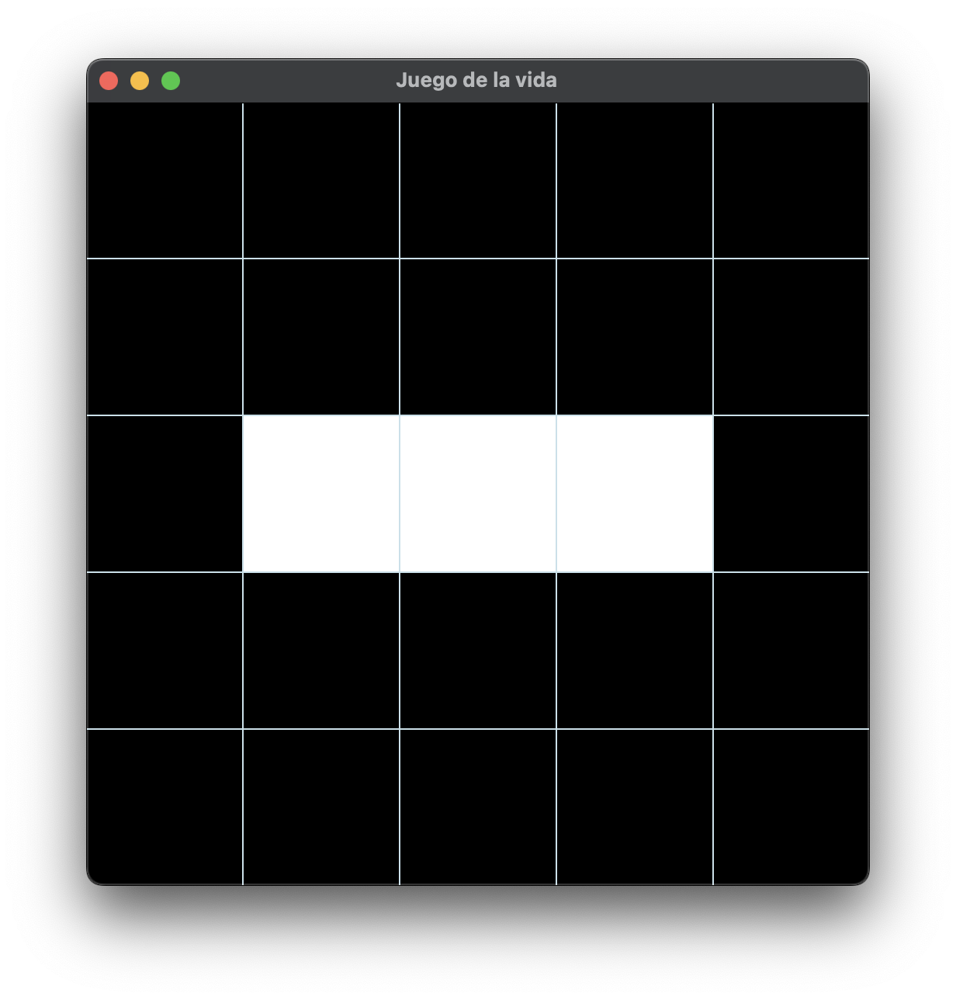
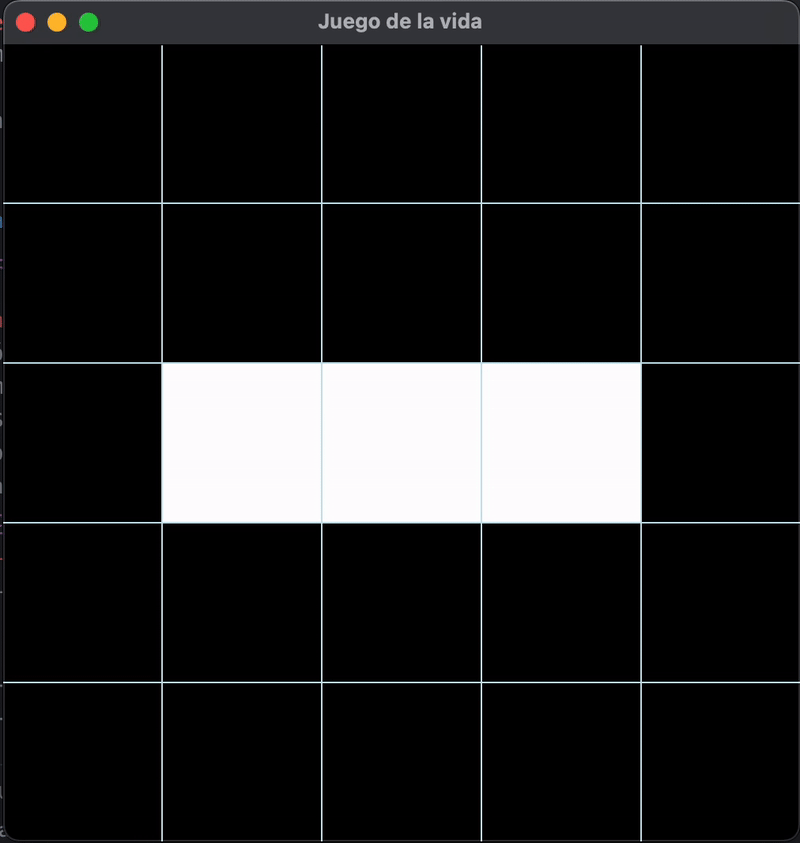

# Juego de la vida
El Juego de la vida es un autómata celular diseñado por el matemático británico John Horton Conway en 1970. Es un juego de cero jugadores, en el que su evolución es determinada por un estado inicial, sin requerir intervención adicional. Se considera un sistema Turing completo que puede simular cualquier otra Máquina de Turing.

El "tablero de juego" es una malla plana formada por cuadrados (las "células") que se extiende por el infinito en todas las direcciones. Por tanto, cada célula tiene 8 células "vecinas", que son las que están próximas a ella, incluidas las diagonales. Las células tienen dos estados: están "vivas" o "muertas" (o "encendidas" y "apagadas"). El estado de las células evoluciona a lo largo de unidades de tiempo discretas (se podría decir que por turnos). El estado de todas las células se tiene en cuenta para calcular el estado de las mismas al turno siguiente. Todas las células se actualizan simultáneamente en cada turno, siguiendo estas reglas:

* Nace: Si una célula muerta tiene exactamente 3 células vecinas vivas "nace" (es decir, al turno siguiente estará viva).
* Muere: una célula viva puede morir por uno de 2 casos:
* * Sobrepoblación: si tiene más de tres vecinos alrededor.
* * Aislamiento: si tiene solo un vecino alrededor o ninguno.
* Vive: una célula se mantiene viva si tiene 2 o 3 vecinos a su alrededor.

[wikipedia](https://es.wikipedia.org/wiki/Juego_de_la_vida)

# Programa
Se realizó una adaptación del juego de la vida, ya que únicamente se considera una rejilla de $5\times5$. El programa fue realizado en ```c++``` utilizando la biblioteca ```SFML```. Se requiere la instalación de [cmake](https://cmake.org) y [sfml](https://www.sfml-dev.org). 
## Ejecución
Para compilar el programa es necesario ejecutar

   ```
   cmake -B build
   cmake --build build
   ```
Para correr el programa:
   ```
   ./build/juego
   ```
# Tarea
El objetivo de esta tarea es repasar los conceptos de clases y sintaxis de ```c++```, además de probar las instalaciones de ```cmake``` y ```sfml``` las cuales serán de utilidad en el futuro.

Si se compila y ejecuta el programa en el estado actual se generarán algunos warnings y se obtendrá la siguiente pantalla:


Sin embargo, la aplicación no tendrá responsividad alguna. La tarea consiste en completar las funciones faltantes para conseguir que la aplicación sea funcional.
### Funciones a completar
En el archivo [Celula.cpp](./src/Celula.cpp) se requieren completar:
* void Celula::cambiaEstado()
* bool Celula::isViva()
* void Celula::setEstadoFuturo(bool estado)
* bool Celula::getEstadoFuturo()  

Los comentarios e indicaciones del funcionamiento de cada función se encuentran en el archivo [Celula.h](.//include/Celula.h)

En el archivo [main.cpp](./src/main.cpp) se requiere completar:
* void calculaEstadosFuturos(const std::vector<Celula*>& celulas) 

### Término
Al finalizar las funciones y si todo está correctamente implementado, se podrá dar click a cada célula para cambiar su estado:


Y al presionar la tecla ```Enter```, se llevará acabo una simulación de 25 iteraciones. Sino quedan células vivas la simulación se detendrá para poder probar nuevas configuraciones. Se recomienda realizar una prueba con la siguiente configuración, el cual es conocido como el oscilador intermitente con periodo 2:



# Entrega
Se deberá entregar a la asignación de classroom un enlace al repositorio de github dónde realizaron su tarea. 

# Fecha de entrega
La tarea tiene como fecha de entrega el miércoles 18 de Febrero de 2026.

**Nota: Por cada semana de retraso se descontará un punto sobre la calificación máxima de 10**

# Dudas
Para cualquier duda, comentario o problema con las instalaciones por favor manden correo a:
```ramarc2@ciencias.unam.mx```
